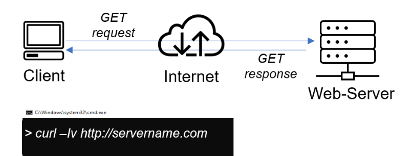
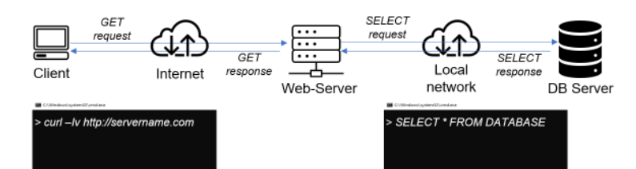
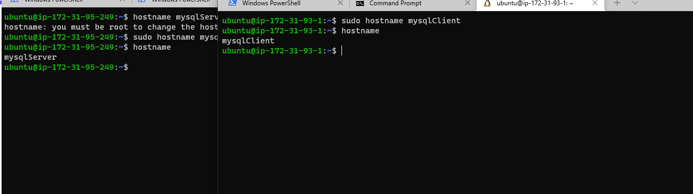
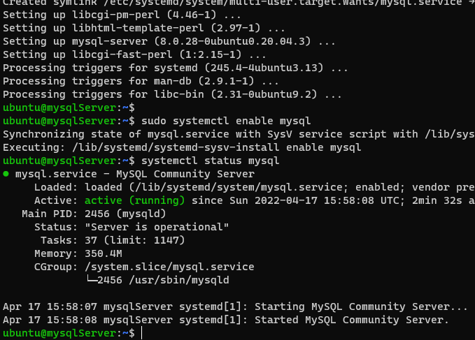
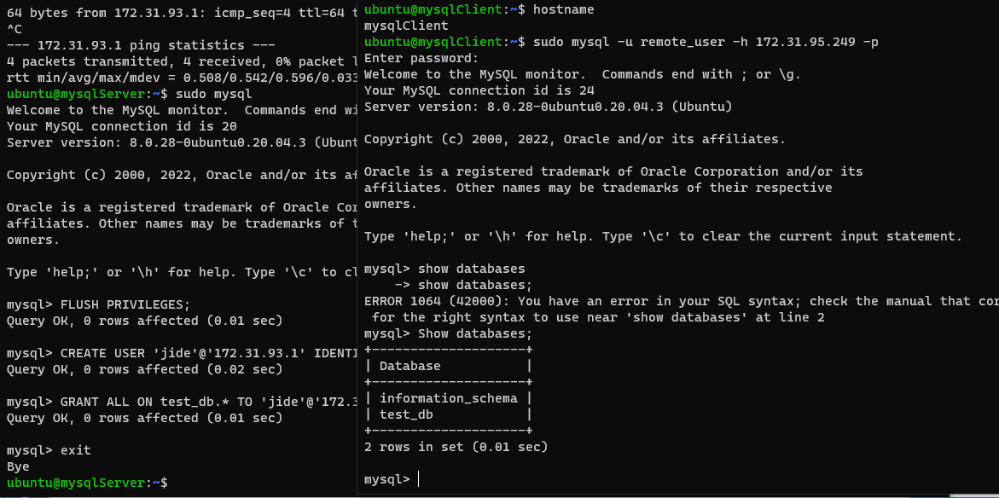

# Project-5

# CLIENT-SERVER ARCHITECTURE WITH MYSQL

## Understanding Client-Server Architecture
Client-Server refers to an architecture in which two or more computers are connected together over a network to send and receive requests between one another.
In their communication, each machine has its own role: the machine sending requests is usually referred as "Client" and the machine responding (serving) is called "Server".

A simple diagram of Web Client-Server architecture is presented below:

In the example above, a machine that is trying to access a Web site using Web browser or simply ‘curl’ command is a client and it sends HTTP requests to a Web server (Apache, Nginx, IIS or any other) over the Internet.

If we extend this concept further and add a Database Server to our architecture, we can get this picture:

In this case, our Web Server has a role of a "Client" that connects and reads/writes to/from a Database (DB) Server (MySQL, MongoDB, Oracle, SQL Server or any other), and the communication between them happens over a Local Network (it can also be Internet connection, but it is a common practice to place Web Server and DB Server close to each other in local network).

The setup on the diagram above is a typical generic Web Stack architecture that you we already implemented in previous projects (LAMP, LEMP, MEAN, MERN), this architecture can be implemented with many other technologies – various Web and DB servers, from small Single-page applications SPA to large and complex portals.

# IMPLEMENT A CLIENT SERVER ARCHITECTURE USING MYSQL DATABASE MANAGEMENT SYSTEM (DBMS)

TASK – Implement a Client Server Architecture using MySQL Database Management System (DBMS).
To demonstrate a basic client-server using MySQL Relational Database Management System (RDBMS), follow the below instruction

1.Create and configure two Linux-based virtual servers (EC2 instances in AWS).

Server A name - `mysql server`
Server B name - `mysql client`

2.On mysql server Linux Server install MySQL Server software
 
`sudo apt update`

 `sudo apt install mysql-server -y`

`systemctl enable mysql`

3.On mysql client Linux Server install MySQL Client software

`sudo apt update`

`sudo apt install mysql-client -y`

`sudo mysql_secure_installation`

`sudo mysql`

CREATE A USER

`CREATE USER 'remote_user'@'%' IDENTIFIED WITH mysql_native_password BY 'password';`

CREATE A DB

`CREATE DATABASE test_db;`

GRANT PRIVILEGES

`GRANT ALL ON test_db.* TO 'remote_user'@'%' WITH GRANT OPTION;`

`FLUSH PRIVILEGES; `

`exit`

EDIT THE MYSQL CONFIGURATION FILE. 
The binding address should point to 0.0.0.0

RESTART MY SQL

`sudo systemctl restart mysql`

4.By default, both of your EC2 virtual servers are located in the same local virtual network, so they can communicate to each other using local IP addresses. Use mysql server's local IP address to connect from mysql client. MySQL server uses TCP port 3306 by default, so you will have to open it by creating a new entry in ‘Inbound rules’ in ‘mysql server’ Security Groups. For extra security, do not allow all IP addresses to reach your ‘mysql server’ – allow access only to the specific local IP address of your ‘mysql client’

5.You might need to configure MySQL server to allow connections from remote hosts

`sudo vi /etc/mysql/mysql.conf.d/mysqld.cnf`

6.From mysql client Linux Server connect remotely to mysql server Database Engine without using SSH. You must use the mysql utility to perform this action.

`sudo mysql -u remote_user -h 172.31.95.249 -p`

The project is completed as we have been able to connect to the mysql-server EC2 from the mysql-client EC2 Instance